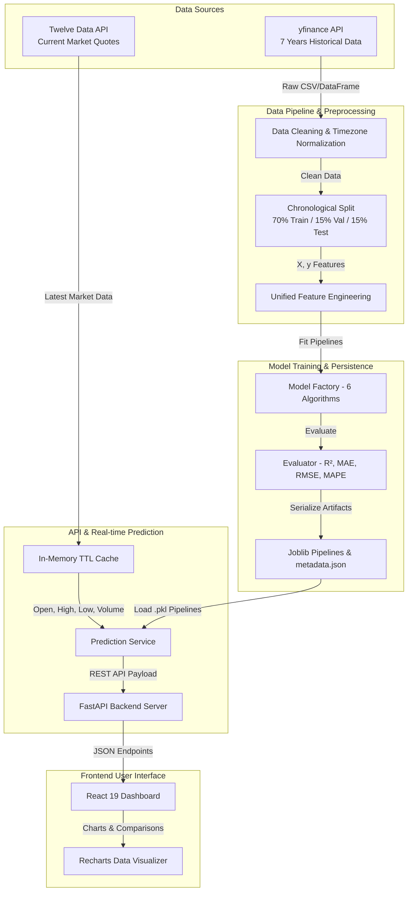

# Real-Time Multi-Asset Price Prediction Suite 🚀

> **Production-Grade Machine Learning Web Application for Stock & Cryptocurrency Price Forecasting**


---

## 📌 Executive Summary

The **Real-Time Multi-Asset Price Prediction Suite** is a full-stack financial machine learning application designed to forecast current-day closing prices (`Close`) for equity and cryptocurrency assets (**Reliance Industries**, **Bitcoin**, and **Google / Alphabet**).

It leverages **7 years of historical daily market data** to train, validate, and compare **6 distinct machine learning algorithms**:
1. **Simple Linear Regression** ($X = [\text{Open}]$)
2. **Multiple Linear Regression** ($X = [\text{Open}, \text{High}, \text{Low}, \text{Volume}]$)
3. **Polynomial Regression (Degree 2)** ($X = [\text{Open}, \text{High}, \text{Low}, \text{Volume}]$ with quadratic interactions)
4. **Support Vector Regression (SVR - RBF Kernel)**
5. **Random Forest Regressor** (100 Decision Trees ensemble)
6. **Gradient Boosting Regressor** (Sequential residual boosting)

Predictions are powered by **Twelve Data API** for current market quotes with automated fallback to **yfinance**, delivered through a high-performance **FastAPI backend** and visualized via an interactive **React + Recharts dark glassmorphism dashboard**.

---

## 📐 System Architecture



---

## 🛠️ Tech Stack

### **Backend (Python 3.11+)**
* **Framework:** [FastAPI](https://fastapi.tiangolo.com/) + [Uvicorn](https://www.uvicorn.org/)
* **Machine Learning:** [Scikit-Learn](https://scikit-learn.org/), [Joblib](https://joblib.readthedocs.io/)
* **Data Processing:** [Pandas](https://pandas.pydata.org/), [NumPy](https://numpy.org/)
* **Data Sources:** [yfinance](https://github.com/ranaroussi/yfinance), [Requests](https://requests.readthedocs.io/), Twelve Data API
* **Validation & Config:** [Pydantic v2](https://docs.pydantic.dev/), [python-dotenv](https://github.com/theskumar/python-dotenv)
* **Testing:** [Pytest](https://docs.pytest.org/)

### **Frontend (React 19 + Vite)**
* **Framework:** React 19 (ESModules)
* **Build Tool:** Vite
* **Data Visualization:** Recharts
* **Icons:** Lucide React
* **Styling:** Vanilla CSS with custom Dark Glassmorphic Design System (No Tailwind)

---

## 📁 Repository Structure

```
project-root/
├── backend/
│   ├── app/
│   │   ├── main.py                      # FastAPI App initialization & CORS
│   │   ├── api/
│   │   │   └── routes.py                # REST endpoints
│   │   ├── assets/
│   │   │   └── asset_config.py          # Centralized symbol configuration
│   │   ├── core/
│   │   │   └── config.py                # Environment & path configuration
│   │   ├── ml/
│   │   │   ├── preprocessing.py         # Data cleaning & chronological split
│   │   │   ├── feature_engineering.py   # Unified training & prediction features
│   │   │   ├── model_factory.py         # Sklearn pipeline factory (6 models)
│   │   │   ├── evaluator.py             # Common metrics calculator
│   │   │   └── trainer.py               # Master trainer & artifact generator
│   │   ├── models/
│   │   │   └── schemas.py               # Pydantic request/response schemas
│   │   ├── services/
│   │   │   ├── market_data_service.py   # Twelve Data fetcher with yfinance fallback
│   │   │   ├── model_service.py         # Joblib artifact loader
│   │   │   └── prediction_service.py    # Multi-model prediction orchestrator
│   │   └── utils/
│   ├── data/
│   │   └── historical/                  # Saved historical CSV datasets
│   ├── models/                          # Persisted Joblib pipelines & metadata
│   │   ├── reliance/latest/
│   │   ├── bitcoin/latest/
│   │   └── google/latest/
│   ├── scripts/
│   │   ├── download_data.py             # Dataset fetcher script
│   │   └── train_all_models.py          # Automated multi-asset model training
│   ├── tests/
│   │   └── test_backend.py              # Pytest backend test suite
│   ├── requirements.txt
│   ├── .env.example
│   ├── main.py                          # Uvicorn runner
│   └── render.yaml                      # Render cloud deployment specification
├── frontend/
│   ├── src/
│   │   ├── components/                  # Header, MarketCard, PredictionCards, etc.
│   │   ├── pages/                       # Dashboard page
│   │   ├── services/                    # API client layer
│   │   ├── hooks/                       # Custom useAssetData hook
│   │   ├── utils/                       # Currency & percent formatters
│   │   ├── App.jsx
│   │   └── App.css
│   ├── package.json
│   └── vite.config.js
└── README.md
```

---

## ⚡ Quick Start & Installation

### 1. Clone & Set Up Backend

```bash
cd backend

# Create virtual environment (optional)
python -m venv venv
source venv/bin/activate  # On Windows: venv\Scripts\activate

# Install dependencies
pip install -r requirements.txt

# Create .env file
cp .env.example .env
```

### 2. Train Machine Learning Models

Train all 6 ML algorithms across Reliance, Bitcoin, and Google:

```bash
python scripts/train_all_models.py
```

### 3. Run Backend Server

```bash
python main.py
```

The FastAPI API server will start at: `http://localhost:8000`  
API Swagger Documentation available at: `http://localhost:8000/docs`

### 4. Set Up & Run Frontend

```bash
cd ../frontend

# Install dependencies
npm install

# Start Vite Development Server
npm run dev
```

Open your browser at `http://localhost:5173`.

---

## 📊 Machine Learning Model Suite

| Model Key | Algorithm | Input Features ($X$) | Description & Formula |
| :--- | :--- | :--- | :--- |
| `linear` | **Simple Linear Regression** | `Open` | Fits OLS straight line: $\text{Close} = b_0 + b_1(\text{Open})$ |
| `multiple_linear` | **Multiple Linear Regression** | `Open, High, Low, Volume` | Fits 4D hyperplane: $\text{Close} = b_0 + b_1\text{Open} + b_2\text{High} + b_3\text{Low} + b_4\text{Volume}$ |
| `polynomial` | **Polynomial Regression (Degree 2)** | `Open, High, Low, Volume` | Includes quadratic interactions ($X_i^2$) via `PolynomialFeatures` |
| `svr` | **Support Vector Regression** | `Open, High, Low, Volume` | `StandardScaler` + SVR with Radial Basis Function (RBF) Kernel ($C=100.0, \epsilon=0.1$) |
| `random_forest` | **Random Forest Regressor** | `Open, High, Low, Volume` | `StandardScaler` + Ensemble of 100 Decision Trees (`max_depth=10`) |
| `gradient_boosting` | **Gradient Boosting Regressor** | `Open, High, Low, Volume` | `StandardScaler` + Sequential residual boosting (`learning_rate=0.1`) |

---

## 🕒 Time-Series Validation (No Data Leakage)

Financial time-series data possesses temporal autocorrelation. **Random train/test shuffling causes severe future data leakage.**

This project uses strict **Chronological Splitting**:
- **70% Training Set** (Earliest 5 years)
- **15% Validation Set** (Intermediate data)
- **15% Test Set** (Most recent ~1 year holdout)

Evaluation metrics ($R^2$, MAE, RMSE, MAPE) are calculated strictly on the unseen **Test Set**.

---

## 🌐 FastAPI Endpoints

| Method | Endpoint | Description |
| :--- | :--- | :--- |
| `GET` | `/health` | Server health check |
| `GET` | `/assets` | Lists supported assets (Reliance, Bitcoin, Google) |
| `GET` | `/historical/{asset_id}` | Retrieves historical market records |
| `GET` | `/prediction/{asset_id}` | Real-time multi-model predictions |
| `POST` | `/prediction` | Custom input prediction payload |
| `GET` | `/models/{asset_id}` | Training metadata & parameters |
| `GET` | `/model-comparison/{asset_id}` | Ranked comparison metrics |

---

## 🚀 Cloud Deployment Configuration

* **Backend Deployment:** Configured for [Render](https://render.com) via `render.yaml`. Automated build command runs `pip install` and executes `train_all_models.py` during deployment.
* **Frontend Deployment:** Production static build via Vite (`npm run build`) optimized for [Vercel](https://vercel.com) or [Netlify](https://netlify.com).
* **Crucial Environment Variable for Hosted Frontend:**
  Set `VITE_API_BASE_URL` in your hosting provider's Environment Variables panel pointing to your deployed FastAPI backend URL:
  ```env
  VITE_API_BASE_URL=https://<your-backend-name>.onrender.com
  ```
  *Note: If `VITE_API_BASE_URL` is omitted, the frontend defaults to `http://localhost:8000` in local development mode.*


---

## ⚠️ Important Financial Disclaimer

> **Predictions are generated by machine-learning models trained on historical and current market data. They are statistical estimations for technical analysis and educational purposes only, NOT guaranteed future prices or financial advice.**
